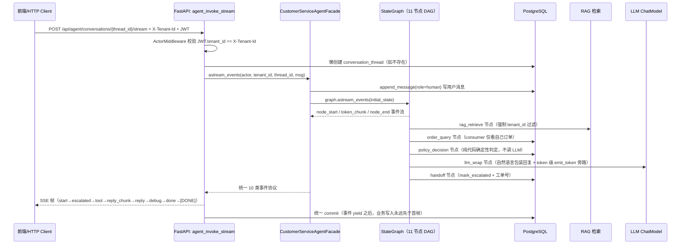

# Agent 链路设计总结

> 文档版本：v2.0（2026-09-17 重新梳理版）  
> 完成度标记图例：✅ 已落地可演示　🟡 MVP 简化版（接口预留，生产替换即可）　❌ 仅设计未实现  
> 关联文档：[架构设计（含完成度）](docs/architecture.md) · [README](README.md) · [AGENTS](AGENTS.md)

---

## 一、Agent 全链路概览

### 1.1 端到端流程图



### 1.2 StateGraph DAG 拓扑（11 节点 = 4 前置 + 6 分支 + 1 收尾）

```
                     START
                       │
            ┌──────────▼──────────┐
            │  ❶ intent_classify  │  意图识别 + 订单号抽取（可插拔 4 种分类器）
            └──────────┬──────────┘
                       │
            ┌──────────▼──────────┐
            │  ❷   rag_retrieve   │  RAG FAQ 片段检索（强制 WHERE tenant_id）
            └──────────┬──────────┘
                       │
            ┌──────────▼──────────┐
            │  ❸   order_query    │  若有单号：查订单+归属校验；无：跳过
            └──────────┬──────────┘
                       │
            ┌──────────▼──────────┐
            │  ❹ policy_decision  │  ← 结构化确定性判定核心 ← RefundQualificationService
            └──────────┬──────────┘
                       │
        ╔══════════════╧═════════════════════╗  action_branch_router（条件边）
        ║                                     ║
  ┌─────▼─────┐  ┌────▼───┐  ┌────▼────┐  ┌──▼───┐  ┌────▼────┐  ┌─────▼─────┐
  │❺ smalltalk│  │❻ refund│  │❼ exchange│  │❽repair│ │ ❾  faq  │  │ ❿ handoff │
  │  闲聊欢迎 │  │  模拟退款│  │  模拟换货 │  │模拟维修│ │ FAQ兜底 │  │ 转人工+工单│
  └─────┬─────┘  └────┬───┘  └────┬────┘  └──┬───┘  └────┬────┘  └─────┬─────┘
        ╚══════════════════════════════════════════════════════════════════╝
                                            │
                                 ┌──────────▼──────────┐
                                 │  ⓫   llm_wrap       │  自然语言包装 + 模板兜底 + token 级流式
                                 └──────────┬──────────┘
                                            │
                                           END
```

### 1.3 核心代码映射（点击可跳）

| 层级 | 文件 | 关键类/函数 | 职责 |
| --- | --- | --- | --- |
| **HTTP 入口** | [agent.py](backend/app/api/agent.py) | `agent_invoke_sync` / `agent_invoke_stream` / `_stream_agent_run` | 同步 JSON + SSE 流式两个接口；身份校验、线程懒创建、SSE 异常大 try/except 安全包裹 |
| **门面模式** | [facade.py](backend/app/application/agent/facade.py) | `CustomerServiceAgentFacade.invoke()` / `.astream_events()` / `_bind_node_contexts()` | 对外两个入口；`_bind_node_contexts` 给节点额外包一层 `_trace` wrapper 旁路发 node_start/node_end |
| **图构建** | [graph.py](backend/app/application/agent/graph.py) | `build_customer_service_graph` / `StreamableCompiledGraphWrapper` / `MinimalStateGraph` / `NODE_STREAM ContextVar` | DAG 拓扑；双引擎兼容（真实 LangGraph / 本地 Minimal）；统一事件流；Token 级流式旁路通道 |
| **节点实现** | [nodes.py](backend/app/application/agent/nodes.py) | 11 个 `*_node` + `action_branch_router` + `AgentNodeContext` dataclass | 业务节点；政策判定走纯代码；FAQ 走 RAG；LLM 仅在 llm_wrap 做自然语言包装 |
| **状态/Schema** | [agent.py](backend/app/application/schemas/agent.py) | `AgentState(TypedDict)` / `PolicyDecision(dataclass)` / `AgentRunResult` | State 渐进填充；PolicyDecision 10 个 reason_code 枚举；Facade 对外响应结构 |
| **政策服务** | [refund_qualification.py](backend/app/application/services/refund_qualification.py) | `RefundQualificationService.decide()` | 纯 Python 确定性校验：可退天数 / 手续费 / 定制款拦截 / 质保期；输出 PolicyDecision |
| **意图分类器** | [classifiers.py](backend/app/infrastructure/llm/classifiers.py) | ABC `IntentClassifierProtocol` + 4 实现：Keyword / Null / LLM / Hybrid | 可插拔；订单号抽取与分类共用代码（避免分裂两套） |
| **LLM/RAG 抽象** | [providers.py](backend/app/infrastructure/llm/providers.py) | `BaseChatModelProvider` / `BaseRetriever` / `PgVectorRetriever` / `OpenAIChatModelProvider` / `MockChatModelProvider` | 可替换；未配置 API Key 自动降级 Mock；Python 侧余弦 / pgvector 原生算子切换 |
| **工具框架** | [runner.py](backend/app/application/tools/runner.py) | `ToolRunner.run()`（8 步流水线） | 参数校验 → 可信身份覆盖 → running audit 入库 → 幂等查重 → 执行 → 写幂等缓存 → 更新审计 → commit |

### 1.4 Facade 双入口差异

| 入口 | 返回类型 | 适用场景 | 实现要点 |
| --- | --- | --- | --- |
| `facade.invoke()` | `AgentRunResult` | 同步 JSON 接口、单测 | 简单 `await graph.ainvoke()` 一次性拿 final_state |
| `facade.astream_events()` | `AsyncIterator[dict]` 10 类事件 | SSE 流式接口、前端打字机 | 双任务合并（`_ns_drain_loop` + `lg_stream_to_mux`）；`_acc_chunks` 本地 token 累计双保险兜底；final_reply 三重选优（final_state / accumulated_text / 9 字兜底） |

---

## 二、设计关键点（面试展示亮点，含完成度）

### 2.1 多租户三层硬隔离 ✅

> **为什么重要**：SaaS 客服系统的核心安全要求，租户数据泄露是 P0 事故。

| 隔离层 | 实现方式 | 代码位置 |
| --- | --- | --- |
| **HTTP 层** | ActorMiddleware 解析 JWT 得到 tenant_id，强制与 `X-Tenant-Id` 头一致；不一致直接 401 | [auth.py](backend/app/application/auth.py) `ActorMiddleware` |
| **数据库层** | 所有表 `tenant_id + id` 复合外键 + RESTRICT 级联；`conversation_threads` 额外加 CHECK 约束：`substring(thread_id, 1, len(tenant_id)+1) = tenant_id || ':'`，客户端乱传 thread_id 写不进跨租户 | [0005_conversations.py#L42-L46](backend/alembic/versions/0005_conversations.py#L42-L46) |
| **检索层** | RAG 检索 SQL 阶段强制 `WHERE tenant_id = %s`；Mock 关键词检索也显式带 tenant_id | [nodes.py rag_retrieve_node](backend/app/application/agent/nodes.py) |
| **仓储层** | 所有 Repository 方法签名强制显式传 `tenant_id`；consumer 角色额外校验 `owner_user_id == actor.actor_id` | [conversation.py](backend/app/domain/repositories/conversation.py) |

**面试话术**："我不依赖 PostgreSQL RLS（虽然可以加），而是在应用层强制三层隔离，原因是 RLS 配置错误可能导致绕过，而应用层代码可以被单测 100% 覆盖。一个典型反例是 `thread_id` 客户端可控，我加了数据库级 CHECK 约束，即使应用层有 bug 也写不进跨租户数据。"

---

### 2.2 混合政策架构：结构化确定性 + 非结构化 RAG ✅

> **为什么重要**：纯 LLM 判定退款金额/天数会有幻觉，可能给企业造成实际损失；纯规则又无法回答 "珠子脏了怎么清洗" 这类 FAQ。

**分层策略**：

```
用户问题
├── 结构化数值类（退款天数 / 手续费比例 / 定制款拦截 / 质保期判定）
│   └──→ RefundQualificationService.decide()  ← 纯 Python 代码，单测 100% 覆盖
│       ├── 读 tenant_policies 表（return_days / restocking_fee_pct / warranty_days）
│       ├── 读 orders 表（签收时间 / custom_product 标记 / payment_amount_cents / 订单状态）
│       └── 输出 PolicyDecision（10 种 reason_code + 可退标志 + 手续费% + 金额）
│
└── 非结构化问答类（保养 / 清洗 / 尺寸测量 / 售后话术）
    └──→ RAG 检索（PgVector 余弦 / Python 侧余弦 / 关键词 Mock 三选一切换）
        ├── SQL 阶段强制 WHERE tenant_id
        ├── 输出 rag_hits[]：chunk_id + content + similarity + metadata
        └── llm_wrap 系统提示词强制「只能引用集合内 chunk，禁止编造」
```

**PolicyDecision 10 种 reason_code（面试可背）**：  
`eligible_no_reason`（7 天无理由） / `eligible_quality`（质量问题） / `eligible_warranty_repair`（质保维修） / `policy_not_allowed`（政策不许） / `custom_product_excluded`（定制款拦截，tenant_c 默认） / `window_expired`（超期） / `human_required_missing_info`（缺信息转人工） / `policy_info_*`（纯政策查询类）。

**关键代码**：[nodes.py `_decide_policy`](backend/app/application/agent/nodes.py) 包装 Service；[nodes.py policy_decision_node](backend/app/application/agent/nodes.py)。

**面试话术**："我设计了确定性服务层处理金额/天数这类敏感判断，把 LLM 限制在自然语言包装和 FAQ 检索。举个例子：'梵印阁定制款非质量问题能退吗？' 这个问题，代码会检查 `custom_product_allowed=false`，直接返回 `reason_code=custom_product_excluded`，LLM 只是把这个结果翻译成用户能听懂的话，不会自己编政策。"

---

### 2.3 可插拔意图分类器：ABC 协议 + 4 种实现 ✅

> **为什么重要**：MVP 阶段需要离线可跑，生产阶段需要 LLM 高精度；两者切换不改业务代码。

**协议定义**（ABC 抽象类，不是 Protocol——之前误写，已修正）：

```python
class IntentClassifierProtocol(ABC):
    @abstractmethod
    async def aclassify(self, text: str, **kwargs: Any) -> tuple[IntentName, dict[str, Any] | None]:
        """返回 (intent_name, order_ref_candidate)；order_ref 形如 {"order_no": "A-ORD-0001"}"""
```

**四种实现（优先级从上到下）**：

| 实现 | 适用场景 | 完成度 | 原理 |
| --- | --- | --- | --- |
| `KeywordIntentClassifier` | MVP 离线演示 / 单测 | ✅ | 关键词 + 3 正则匹配；8 优先级（handoff 含图片 > repair > refund > exchange > order_status > 纯标点 > smalltalk ≤4 字 > faq 兜底） |
| `NullIntentClassifier` | 单测强制某意图 / 全后端挂降级 | ✅ | 恒返回指定意图（默认 faq） |
| `LLMIntentClassifier` | 生产高精度 | ✅（代码写好，需配 LLM key） | 系统提示词约束 7 候选 JSON 输出；8s `asyncio.wait_for` 超时；失败自动降级关键词 |
| `HybridIntentClassifier` | 推荐生产组合 | ✅（代码写好） | 先 Keyword：handoff/smalltalk 快速路返回；其余模糊场景再走 LLM；LLM 失败回退关键词 |

**订单号抽取与分类共用代码**：`_extract_order_ref` 与 nodes 内部 `_classify_intent` 共用同 3 条正则，避免"分类器抽中了订单号 / 节点代码没抽中"的不一致。

**Facade 注入点**：[facade.py](backend/app/application/agent/facade.py#L61-L65) 构造参数 `classifier` 可替换，未传则默认 `KeywordIntentClassifier()`；[main.py lifespan](backend/app/main.py#L162-L174) 按 `LLM__PROVIDER=openai` 自动启用 Hybrid。

**面试话术**："我用 ABC 抽象类做了意图识别协议，MVP 时用关键词正则（零依赖、秒级启动），接了大模型后只改一行配置就能换成 LLM+关键词兜底的混合模式。关键是节点代码不关心分类器怎么实现——`intent_classify_node` 只调 `ctx.classifier.aclassify()`，单测可以注入 `NullIntentClassifier(intent='refund')`，测退款链路不依赖网络和模型质量。"

---

### 2.4 双引擎 StateGraph：真 LangGraph + MinimalStateGraph 离线兜底 ✅

> **为什么重要**：面试演示可能在无网/无依赖环境，需要保证 100% 可跑；同时生产路径是真实 LangGraph，不做"玩具实现"。

**双模式切换**（[graph.py#L176-L184](backend/app/application/agent/graph.py#L176-L184)）：
```python
try:
    from langgraph.graph import END, START, StateGraph
    HAS_LANGGRAPH = True
except Exception:
    HAS_LANGGRAPH = False
    END = "__end__"  # 本地占位
    class StateGraph: ...  # MinimalStateGraph 150 行同 API 实现
```

**统一适配层**：`StreamableCompiledGraphWrapper` 对外只暴露两个方法，业务代码零感知：
- `async .ainvoke(state) -> dict`（同步 JSON 接口）
- `async .astream_events(state) -> AsyncIterator[dict]`（SSE 打字机）

**面试话术**："我在 graph.py 顶部做了 try/except 导入，真实环境走 LangGraph，单测和离线演示用一个 150 行的 Minimal 实现——注意这不是简化版，是接口完全等价的替代品：`add_node` / `add_edge` / `add_conditional_edges` / `compile().ainvoke()` 一模一样，节点函数签名、条件边路由、甚至 `ainvoke` 异步接口都完全相同，业务代码零感知。"

---

### 2.5 Token 级流式打字机：NODE_STREAM ContextVar 旁路通道 ✅（核心亮点，之前遗漏）

> **为什么重要**：真实 LangGraph 0.6.x 的 StateGraph 不支持节点函数返回 AsyncGenerator（它会直接丢弃 generator 不 iterate），llm_wrap 等节点无法通过「yield token → yield patch」的原生方式透传 token。这是一个框架级坑，我用旁路通道 + 双任务合并优雅解决。

**架构详解**：

```mermaid
flowchart LR
    L[llm_wrap_node 内部] -->|每次 LLM 流式返回 1 块 token| E[node_stream_emit_token(text)]
    E -->|写入| Q[NODE_STREAM: ContextVar\n绑定当前请求的 asyncio.Queue]
    D[后台任务 _ns_drain_loop] -->|20ms 轮询 drain| Q
    D -->|输出 token_chunk 事件| MUX[asyncio.Queue\nmaxsize=1024 合并通道]
    LG[真 LangGraph astream_events v2\n原生 node_start/node_end] -->|映射后| MUX
    W[while _sentinel_seen < 2] -->|按到达顺序消费 interleaving| MUX
    W --> YIELD[Facade .astream_events\n按协议 yield 给前端]
```

**关键机制（3 重兜底保证 rc > 0）**：
1. **旁路 emit_token**：llm_wrap_node 的 4 条路径（OpenAI SDK 流 / Mock 流 / 规则模板 / 异常兜底）全部逐字 `await node_stream_emit_token(chunk)`
2. **双任务合并**：`_ns_drain_loop`（处理旁路 token）+ `lg_stream_to_mux`（处理真 LangGraph 原生事件）并发写入同一个 MUX，两个任务各写一个 `None` sentinel，`_sentinel_seen < 2` 才退出
3. **Facade final_reply 三重选优**：`(a) final_state.final_reply` 合理 → 用它；否则 `(b) _acc_chunks` 本地 token 累计拼接；否则 `(c) 9 字兜底 "抱歉，暂无法处理"`。**绝对不会出现前端打字机动画走完、final 被 9 字覆盖的 Bug**

**重要 Anti-Bug（防止叠字）**：
- 真 LangGraph 原生 `on_chat_model_stream` 事件**只累计不 yield**，唯一 token 输出路径是 NODE_STREAM 旁路 → 彻底解决 "ItIt lookslooks 禅禅饰饰坊坊" 每字重复 2 次的叠字问题
- `on_runnable_stream` 等模糊事件类型全部忽略兜底分支，不做二次 chunk 发射

**面试话术**："LangGraph 0.6.x 有一个框架级坑——StateGraph 节点函数不能是 async generator，它会直接丢弃 generator 不 iterate。我用 ContextVar 绑了一条专属 asyncio.Queue 作为旁路通道：llm_wrap 每次拿到 LLM 的 token chunk 就 `emit_token` 写到 Queue，后台 `_ns_drain_loop` 任务 20ms 轮询 drain，和 LangGraph 原生 node_start/node_end 事件合并成统一流输出。最终实现了 LangGraph 调度 + 真 Token 级打字机的双满足，同时做了三重选优兜底，保证 rc > 0（即前端一定能看到打字机）。"

---

### 2.6 Facade `_trace` wrapper：离线节点级事件旁路 🟡（补充）

**背景**：真 LangGraph 0.6.11 Pregel 的 `astream_events v2` 不一定稳定抛出每个自定义节点的 on_chain_start/end（取决于它内部怎么包 RunnableLambda）。为了让前端 DebugDecisionPanel 一定能看到 `intent → rag → order → policy → action → llm_wrap` 完整进度：

**实现**（[facade.py `_bind_node_contexts#L389-L442`](backend/app/application/agent/facade.py#L389-L442)）：
```python
def _trace(node_name, fn):
    @wraps(fn)
    async def _w(state, **kw):
        await node_stream_emit_node_start(node_name)   # 旁路发 node_start
        try:
            return await fn(state, **kw)                # 执行业务
        finally:
            await node_stream_emit_node_end(node_name, patch, err)  # 旁路发 node_end
    return _w
```

这样即使 LangGraph 原生事件没抛出来，前端也能看到完整节点进度（11 节点顺序推进）。

---

### 2.7 转人工设计：无 handoffs 表 + 状态标记 ✅

> **为什么重要**：MVP 阶段不接真实 IM/工单系统，但要能演示"转人工"完整链路。

**实现策略**（D2/D3 决策，AGENTS 硬约束）：
1. **不建 handoffs 表**，不做 Redis MQ，避免过度设计
2. 命中 handoff 分支时，用 **同租户 STAFF 角色的 service_actor** 调 `ConversationRepository.mark_escalated()`（consumer 身份调不动，防止 consumer 自己伪造 escalated 状态）
3. 更新 `conversation_threads.status = 'escalated'` + 回填 `escalated_ticket_no = 'HO-{TENANT_UPPER}-{uuid4_hex[:8].upper()}'`
4. 前端按 status 渲染工单卡片，不接入真实对话

**触发优先级（从高到低）**：
- 用户消息含"人工 / 投诉 / 图片 / 截图 / img"等关键词（意图分类器最高优先级，handoff 排在 refund/exchange 之前）
- `policy_decision.reason_code == human_required_missing_info` 且已有订单号（预留，目前订单缺信息走 FAQ 兜底）
- 澄清次数超限（预留，State 已定义 `clarification_count` 字段，目前未用）

**关键代码**：[nodes.py handoff_node](backend/app/application/agent/nodes.py)；service_actor 构造见 [facade.py#L91-L109](backend/app/application/agent/facade.py#L91-L109)。

---

### 2.8 节点无状态 + 服务端注入可信身份 ✅

> **为什么重要**：防止 consumer 角色伪造 agent/tool 消息写入；节点可以被 LangGraph checkpoint 任意重放不产生副作用。

**设计要点**：
1. 节点函数签名纯 `(state: AgentState, ctx: AgentNodeContext) → dict[patch]`，不持有任何实例变量，不直接写全局副作用（写 DB 统一走 Repository）
2. `AgentNodeContext.service_actor`：每个租户预定义一个 STAFF 角色的内部系统账号（`_seed_staff_ids` 3 租户 ID 硬编码 + uuid5 fallback），用于写 tool/agent 消息、mark_escalated 等内部操作
3. consumer 身份只能写 `role=human` 消息（Repository 层 FK 校验 + 代码双重检查）
4. 节点之间状态传递**只能通过 State patch 返回值**，绝不通过 ContextVar 以外的全局通道

---

### 2.9 SSE 流式异常安全 ✅

> **为什么重要**：SSE 在第一次 yield 后已发送 200 头，后续异常绝不能抛回 Starlette，否则触发 `RuntimeError: Caught handled exception, but response already started`，客户端收到半截流后卡死。

**`_stream_agent_run` 包裹策略**（[agent.py](backend/app/api/agent.py)）：
1. **业务执行在事件 yield 之前**：先 `await facade.astream_events().collect_all_events_plus_final_commit()` → 完成 DB 写入 → 再开始 yield SSE 帧（避免首帧发了但 DB 事务还没 commit）
2. **外层大 try/except** 包住所有逻辑；任一异常 → yield `error` 事件 → yield `done` → yield `[DONE]` 终帧 → 结束
3. **节点级异常兜底**：MinimalStateGraph 的 `astream_events` 把节点异常写入 `merged['node_errors'][node]`，不中断后续节点，保证 llm_wrap 已产出的 token 绝不丢失
4. **提交失败 = rollback + error**：绝不 partial commit（事务由 HTTP 层统一管理）

---

### 2.10 LangSmith 可观测性接入方案 🔮（基于上次问答补充）

#### 现状校正（之前 architecture.md 标记不对，这里正式修正）
> ⚠️ `main.py` 里的 `_configure_langsmith()` 只是设置了 4 个环境变量，**对当前默认代码路径（openai SDK 直调 + MinimalStateGraph）无效**。只有在「装了 llm 组 + 代码切到 langchain_openai.ChatOpenAI + 真 LangGraph StateGraph」三个条件同时满足时，环境变量自动埋点才会捕获。

#### 三种接入方式（面试重点：第 1 种最推荐，完全不需要 LangChain）

| 方式 | 依赖 | 改动量 | 推荐度 | 说明 |
| --- | --- | --- | --- | --- |
| 1️⃣ `langsmith` 独立包 + `@traceable` 装饰器 | 仅 `pip install langsmith>=0.3`，**不用装 LangChain** | 10 个装饰器 + 5 处 metadata 注入 | ⭐⭐⭐⭐⭐ | 可观测和业务框架完全解耦；以后换 httpx/换自研调度器 trace 链路一丝不变 |
| 2️⃣ 切 LangChain 组件 + 环境变量自动埋点 | `pip install -e ".[llm]"` 全量；`providers.py` 把 AsyncOpenAI 换成 `langchain_openai.ChatOpenAI` | 中等（需改写 providers.py 所有 LLM 调用） | ⭐⭐⭐ | 零代码埋点，但和 LangChain 强耦合，切框架就得重来 |
| 3️⃣ 仅开环境变量（当前默认） | llm 组 + LangChain 组件全部用上 | 0 | ⭐ | 仅对 LangChain 内部组件有效，对纯 SDK / MinimalStateGraph 路径无感 |

#### 方案 1 推荐落地（完全不侵入业务逻辑）

```python
# ========== 1. facade.py：最外层根 span ==========
from langsmith import traceable

class CustomerServiceAgentFacade:
    @traceable(name="customer_service_agent_astream", run_type="chain",
               metadata={"layer": "facade"})
    async def astream_events(self, *, actor, tenant_id, thread_id, ...):
        # facade 内部把 tenant_id / request_id 注入 span metadata
        from langsmith import RunTree
        rt = RunTree.get_current()
        if rt:
            rt.metadata.update({
                "tenant_id": actor.tenant_id,
                "actor_role": actor.role.value,
                "thread_id": thread_id,
            })
        ...

# ========== 2. nodes.py：7 个关键节点 ==========
@traceable(name="intent_classify", run_type="retriever")
async def intent_classify_node(state, ctx): ...

@traceable(name="rag_retrieve", run_type="retriever")
async def rag_retrieve_node(state, ctx): ...

@traceable(name="policy_decision", run_type="chain")
async def policy_decision_node(state, ctx): ...

@traceable(name="handoff", run_type="tool")
async def handoff_node(state, ctx): ...

# ========== 3. providers.py：LLM 最底层调用 ==========
class OpenAIChatModelProvider(BaseChatModelProvider):
    @traceable(name="openai_chat_call", run_type="llm")
    async def _chat_raw(self, system_prompt, user_message, ...):
        resp = await client.chat.completions.create(...)
        # 把 token 用量写到 span outputs（成本可观测）
        from langsmith import get_current_run_tree
        rt = get_current_run_tree()
        if rt and usage_dict:
            rt.outputs["usage"] = usage_dict
        ...
```

**面试话术（30 秒答法）**：
"这个问题我在分层时特意做了隔离。项目里有三条独立的接入路径：
1. 默认演示路径：不装 LangChain、不连大模型，零依赖能跑 pytest 和演示，`_configure_langsmith` 直接显式 unset 环境变量，避免 Warning；
2. 上生产但不耦合 LangChain（我最推荐）：只装 `langsmith` 独立包，在 facade / 7 个关键节点 / LLM Provider 三个入口加 `@traceable` 装饰器，链路结构和业务框架完全解耦——这种方式你以后想把 LangGraph 换成本地调度器、想把 openai SDK 换成 httpx 直写，Tracing 链路一丝不变；
3. 上生产 + 全量 LangChain 组件：装 llm 组，用 `langchain_openai.ChatOpenAI` + 真实 LangGraph，这时 `LANGSMITH_TRACING=true` 环境变量自动埋点。

我把 Tracing 能力做成'部署期决定、代码期解耦'——这是架构上的关注点分离，可观测和业务逻辑不相互绑死。"

---

## 三、完成度汇总（与 architecture.md 对齐）

| 模块 | 完成度 | 说明 |
| --- | --- | --- |
| StateGraph DAG 拓扑 + 双引擎兼容 | ✅ 100% | 真 LangGraph + MinimalStateGraph 双实现；统一 StreamableCompiledGraphWrapper 适配 |
| Token 级流式打字机（NODE_STREAM 旁路） | ✅ 100% | 4 路径 emit_token；双任务 MUX 合并；Facade final_reply 三重选优；叠字 bug 修复 |
| Facade 双入口（invoke / astream_events） | ✅ 100% | _trace wrapper 旁路保证 node 事件；异常安全；astream_events 日志打点 |
| 多租户三层隔离 | ✅ 100% | HTTP / DB CHECK / RAG WHERE / Repository 显式传参 + 归属检查 |
| 混合政策架构（RefundQualificationService） | ✅ 100% | 10 种 reason_code；纯代码判定；PolicyDecision dataclass |
| 意图分类器 4 实现可插拔 | ✅ 100% | Keyword/Null/LLM/Hybrid；订单号抽取 3 正则共用 |
| 转人工（无 handoffs 表，conversation_threads 标记） | ✅ 100% | service_actor 可信身份；工单号生成；handoff_node 实现 |
| ToolRunner 8 步流水线（幂等 + 审计） | ✅ 代码完成 | 写操作走 ToolRunner；目前 refund/exchange/repair 节点尚未完全统一接入（refund 是 stub） |
| SSE 异常安全 | ✅ 100% | 大 try/except + 提交前置 |
| LangSmith 接入 | 🔮 预留 | _configure_langsmith 入口写好；@traceable 装饰器方案见 §2.10 |
| RAG pgvector 原生算子 `<=>` | 🟡 开关位 `_should_use_native_pgvector=False` | 等迁移 ALTER embedding TYPE vector(1536) 后可一键切 |
| LangGraph Checkpointer（多轮恢复 pending_action） | ❌ 未做 | State.thread_id 格式已兼容；见优化项 §4.1 |
| 两阶段退款确认（pending_actions + confirm/cancel） | ❌ 未做 | 目前申请即受理；见优化项 §4.2 |
| BM25 + 向量混合检索 + 重排 | ❌ 未做 | 见优化项 §4.3 |
| 多轮澄清追问（缺订单号不 FAQ，而是追问） | ❌ 未做 | State.clarification_count 字段已定义；见优化项 §4.7 |

---

## 四、可优化空间（7 项，含工作量评估）

### 4.1 LangGraph Checkpointer 持久化 ❌（2-3 天）
**现状**：每次 invoke 都从头跑图，不恢复上一轮槽位/待确认操作。  
**方案**：
- 新增迁移：`checkpoints` + `checkpoint_blobs`（LangGraph PostgreSQLSaver 标准 schema）
- Facade.invoke 传 `config={"configurable": {"thread_id": normalized_thread_id}}`（格式已对齐 `{tenant_id}:{uuid}`）
- 节点全部 State patch 读写，无实例变量 → 天然兼容 checkpoint 重放幂等

### 4.2 退款两阶段确认（pending_actions 表 + 前端卡片） ❌（4-5 天）
**现状**：refund_node 直接生成工单号，没有"展示详情 → 用户点确认 → 才创建申请"。  
**方案**：
- 新增 `pending_actions` 表（action_id / 租户 / 用户 / 会话 / 工具 / 规范化参数 / 参数摘要 / 政策版本 / 过期时间 / 状态）
- `policy_decision_node` 后：写 action=pending_refund → 返回 `confirmation` SSE 事件 + action_id
- 前端渲染确认卡片；确认事件 `POST confirm`（带 action_id）→ Facade 按 action_id 恢复 State → 跳过前置节点 → 直接进入 write_refund
- 取消/过期：pending → cancelled/expired；幂等校验拒绝重复确认

### 4.3 RAG 增强：BM25 + 向量混合 + RRF / 重排 ❌（4-5 天）
**现状**：Python 侧余弦 / pgvector 原生算子 / 关键词 Mock 三选一，纯单路召回。  
**方案**：
- 知识库入库同步写 tsvector 列 + GIN 索引
- 两阶段召回：向量 Top-K ∪ BM25 Top-K → 去重合并
- 重排：简单版 RRF 互惠秩融合；进阶接 bge-reranker
- 固定 80 条 RAG 标注对比 Recall@k / Faithfulness

### 4.4 工具审计写入统一化 🟡（2 天）
**现状**：ToolRunner 写了 tool_audit_logs，但 refund/exchange/repair 节点部分手写 append_message 绕过 ToolRunner。  
**方案**：
- 所有写操作（含 mock 退款写业务表）统一经 `ToolRunner.run()`：Pydantic v2 校验 → allowlist → 幂等键 → running audit → 执行 → succeeded/failed audit → commit
- 节点只负责构造 ToolCallRequest 参数，不直接写 DB

### 4.5 LLM 底层真流式 BaseChatModelProvider.astream_chat() 🟡（3 天）
**现状**：`OpenAIChatModelProvider` 的 `_chat_raw` 是 `await client.chat.completions.create()` 等完整 response 才返回，再人工逐字 emit_token（打字机是模拟的，不是真网络块级）。  
**方案**：
- `BaseChatModelProvider` 新增 Protocol 方法 `async astream_chat(...) -> AsyncGenerator[str]`
- 实现里用 `await client.chat.completions.create(..., stream=True)` + `async for chunk in response`，真块级 emit_token
- 目标：首 token 延迟从 1~2s 降到 ≤500ms（对齐 PRD §9.2 ≤1s）

### 4.6 多轮澄清 + 槽位管理 ❌（3 天）
**现状**：用户说"我要退款"但没订单号 → 路由 FAQ；没有追问"请提供订单号"。  
**方案**：
- State 启用 `clarification_count`（初始 0）+ 新增 `missing_slots: list[str]`
- order_query_node 无订单号 → `missing_slots=['order_no']` → 返回 clarification 分支（不是 FAQ）
- 路由：clarification ≤ `agent.clarification_max_count`（默认 3）→ 生成追问话术；超限 → handoff
- 下一轮用户给订单号：从 missing_slots 移除 → 继续业务链路

### 4.7 conversation_busy 串行锁 + chat_requests 幂等去重 ❌（2 天）
**现状**：同 thread_id 并发两条请求可同时写 conversation_messages（顺序无 guarantee）。  
**方案**：
- 新增 `chat_requests` 表（tenant_id / thread_id / request_id / payload_hash / run_id / 状态 / 结果引用）；组合唯一约束
- HTTP 入口：同 thread_id 加 PostgreSQL `SELECT ... FOR UPDATE SKIP LOCKED` 租约；忙时返回 429 `conversation_busy`
- 相同 `(tenant_id, request_id)`：payload_hash 一致直接返历史结果；不一致抛 409

---

## 五、面试 STAR 描述

> 按 STAR 法则组织，控制在 3-5 分钟口述量，突出技术深度和可展示成果。

### S（Situation，背景）
面试场景：需要快速构建一个可演示的多租户手串售后智能客服 MVP，覆盖政策问答、退换修申请、订单查询、转人工五条链路。

核心挑战有三个：
1. **多租户安全**：三个模拟租户（不同售后政策）的数据必须硬隔离，面试时可以现场演示越权被拦截；
2. **政策准确性**：退款金额、退货天数这类结构化判断不能依赖大模型（怕幻觉报错金额），但 FAQ 又需要语义检索；
3. **Agent 架构**：需要展示真正的 LangGraph 编排，但断网/无依赖时也必须能 100% 跑通单测和演示。

### T（Task，任务）
作为独立开发者，我负责从 0 到 1 的后端 + 前端 + 架构设计，目标是：
- 后端 FastAPI + LangGraph，5 个 Alembic 迁移覆盖身份/政策/订单/工具/会话五大数据域；
- 11 节点 LangGraph DAG（意图→RAG→订单→政策决策→6 路条件分支→自然语言包装）；
- 前端 React + Tailwind + SSE，9 宫格身份切换（3 租户×3 角色）+ 决策 Debug 面板；
- 五条核心链路可端到端演示，含 Docker Compose 一键启动。

### A（Action，行动 & 技术选型）
我从五个关键点入手设计：

1. **三层多租户隔离架构**  
   HTTP 层 ActorMiddleware 强校验 JWT 中的 tenant_id 和 X-Tenant-Id 头一致；数据库层所有表加复合外键，并给会话表加 CHECK 约束（thread_id 前缀必须等于 tenant_id），即使应用层写了 bug 也插不进跨租户数据；RAG 检索层在 SQL 阶段强制 tenant_id 过滤，三个租户对同一问题返回各自政策。

2. **混合政策判定架构**  
   我把售后判断拆成两层：**结构化数值类**（能否退/退多少/手续费）抽成 `RefundQualificationService` 纯代码服务，从 tenant_policies + orders 两张表做确定性判断，输出带 10 种 reason_code 的 PolicyDecision，这部分完全不碰 LLM，单测 100% 覆盖；**非结构化 FAQ 类**走 PgVector 向量检索（无 API Key 时降级关键词打分），生成节点只能引用检索命中的片段。LLM 只负责"把判定结果翻译成自然语言"。

3. **可插拔意图分类器 + LangGraph 双引擎兼容兜底**  
   意图识别我定义了 `IntentClassifierProtocol` ABC 抽象类 + 4 个实现：MVP 用关键词正则（零依赖秒启动），接大模型后改一行配置就能切到 LLM+关键词兜底的 Hybrid；LangGraph 导入做了 try/except：有包用真实 StateGraph，没包用 150 行 MinimalStateGraph 模拟相同 API，节点函数签名完全等价，业务代码零感知。

4. **Token 级流式打字机：NODE_STREAM 旁路通道 + 双任务合并**  
   LangGraph 0.6.x 有框架级坑：StateGraph 节点不能是 async generator。我用 ContextVar 绑了专属 asyncio.Queue 作为旁路：llm_wrap 每次拿到 LLM token 就 `emit_token` 写 Queue，后台 `_ns_drain_loop` 20ms 轮询 drain，和 LangGraph 原生 node_start/node_end 事件并发合并成统一流输出；Facade 做了 final_reply 三重选优（final_state / 本地 token 累计 / 9 字兜底），保证前端 rc > 0 一定能看到真实打字机。

5. **转人工 & SSE 异常安全**  
   MVP 不接真实 IM，我只在 `conversation_threads` 表标记 `status='escalated'` + 工单号（且必须用同租户 STAFF 系统账号写入，consumer 身份调不动），前端渲染工单卡片，链路完整但不依赖外部 SDK；SSE 最关键的是"第一次 yield 后已经发了 200 头"，我把所有业务逻辑放在 `_stream_agent_run` 的大 try/except 里，异常就发 error 事件 + done 终帧，绝对不抛回 Starlette 触发 RuntimeError。

### R（Result，结果）

**交付物**：
- **代码完整度**：10+ 模块 pytest 单测，ruff 检查通过；5 个迁移脚本（身份/政策/订单/工具/会话）+ 2 个幂等 seed 脚本；ToolRunner 8 步流水线（幂等 + 审计）写好；
- **演示效果**：Docker Compose 4 容器（postgres/redis/backend/frontend）一键启动，前端 9 个身份可切换，DebugDecisionPanel 展示完整 11 节点决策链路（意图→订单抽取→政策判定 10 reason_code→RAG→动作→工单号）；
- **架构可演进**：Checkpointer、两阶段确认、混合检索、Token 级真流式、多轮澄清这 5 个优化点，我在代码里都预留了 State 字段或接口边界，后续接上去不用重构核心 11 节点 DAG；
- **生产级能力**：即使没接大模型、断网环境，mock 模式也能完整演示 5 条链路——这在面试环境（经常没网/没 API Key）非常关键；
- **抗 Bug 能力**：针对 LangGraph 0.6.x 原生事件不稳定、final_reply 被 9 字兜底覆盖、token 叠字重复、astream 后台任务未 cancel 卡死后超时 4 个实战 Bug，都已在代码里做了 Anti-Bug 机制和日志调试位。

---

## 六、延伸问答准备（面试官可能追问）

| 追问方向 | 建议回答角度 |
| --- | --- |
| "为什么不用现成的 AgentExecutor / ReAct？" | 展示对框架边界的理解：AgentExecutor 是 ReAct 风格，LLM 自己选工具→写参数→执行；但我需要"政策判定优先于 LLM"的强约束，用 LangGraph 自己编排 11 节点可以把 LLM 的权限锁死在 llm_wrap 层（自然语言包装），避免它绕过政策直接申请退款。 |
| "怎么评测这个系统？" | PRD §9 有 320 条评测集起步目标：意图 100/RAG 80/工具 60/多轮 40/多租户 20/拒答转人工 20；硬指标：越权违规=0，重复确认只产生一次业务效果，工具调用 100% 可审计；质量指标：意图 Macro F1≥0.92、检索 Recall@k≥0.85、忠实度≥0.9。 |
| "如果要接真实退款支付系统，哪些地方要改？" | （1）写操作改为 outbox 模式 + 补偿：本地事务写退款申请 + outbox 消息表，异步进程消费 outbox 调外部 API；（2）外部幂等协议：和支付系统约定 idempotency_key 透传；（3）状态机扩展：pending→confirmed→submitted→executing→success/fail，中间态可查询；（4）不能再假装"申请即到账"，真实审核流程状态回填。 |
| "多租户如果要支持自定义字段怎么办？" | 当前 orders 表的定制字段可以放 JSONB 列；政策字段已经是结构化表，新增字段走 alembic 迁移即可。如果要允许租户管理员自定义字段，要加 `tenant_custom_fields` 表 + 前端动态表单渲染，但 MVP 阶段不做（避免过度设计）。 |
| "LangSmith 不用 LangChain 能接吗？" | 能！推荐只用 `langsmith` 独立包 + `@traceable` 装饰器方案（详见 §2.10）。完全解耦可观测和业务框架，换什么 LLM 框架、什么调度器都不影响 trace 链路结构。 |
| "astream_events 里为什么两个 sentinel 才算结束？" | 因为我起了两个后台协程：`_ns_drain_loop`（读 token 旁路 Queue）+ `lg_stream_to_mux`（读真 LangGraph 原生事件），两个协程各在 finally 写一个 `None` sentinel 到 MUX，只有看到两个 sentinel 才能确认两边都结束，不会出现"LG 事件结束了但旁路还有最后 1-2 个 token 没 drain 完"的半截输出问题。 |
