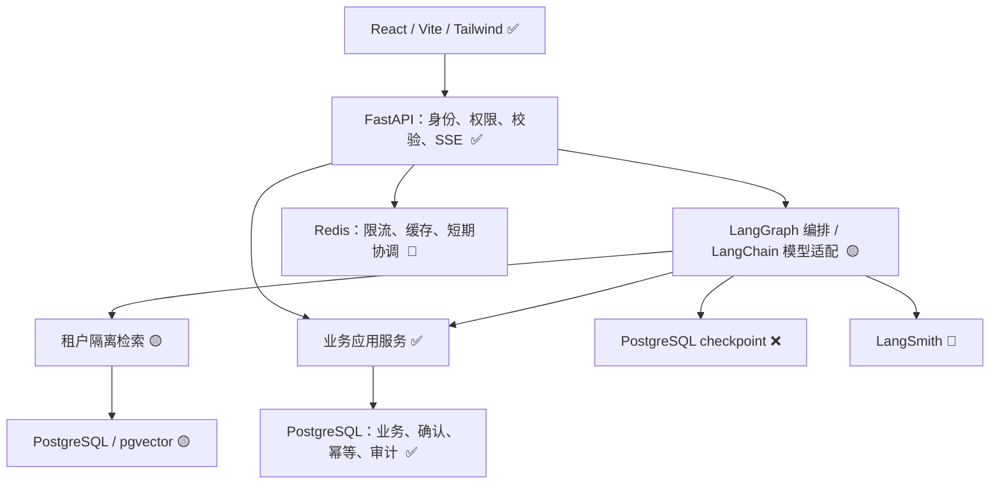
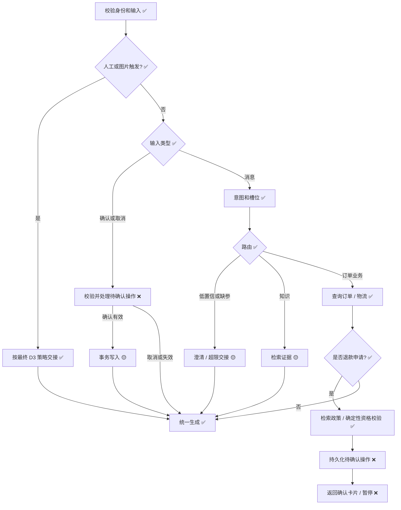

# 架构设计

状态：**v1.2 已落地 + 完成度标记版**。需求依据：[PRD](../PRD.md)，执行规则：[AGENTS.md](../AGENTS.md)，实施清单：[tasks.md](tasks.md)，Agent 链路详解：[agent-design.md](../agent-design.md)。

---

## 完成度图例

| 标记 | 含义 | 面试说明 |
| --- | --- | --- |
| ✅ **已完成** | 代码落地 + pytest 覆盖 | 可以现场演示 |
| 🟡 **MVP 简化** | 有简化版本，可运行；生产级完整方案待接入 | 展示接口边界，说明未来怎么升级 |
| ❌ **未完成** | 仅设计稿，代码未写 | 说明架构预留位置，不改链路即可接入 |
| 🔮 **预留接口** | Protocol / 抽象类已定义，空实现 / stub 待替换 | 展示关注点分离 / 可插拔设计 |

---

## 1. 分层与依赖



HTTP 层和 Agent 工具共用业务服务，授权和确认不能只存在于图节点。图节点不持有用户状态，模型输出必须经过 Pydantic v2 校验。模型客户端和数据库连接等依赖可复用，但不能携带可变会话数据。

**Python 技术栈锁定** ✅（pyproject.toml 已声明），先验证 LangGraph PostgreSQL checkpointer、数据库驱动和模型 SDK 的兼容性并锁定依赖；不在验证前声称可运行。

| 子模块 | 状态 | 代码位置 |
| --- | --- | --- |
| React 前端界面（聊天/身份切换/Debug面板） | ✅ | [App.tsx](../frontend/src/App.tsx) |
| FastAPI 路由 + 中间件 + 异常处理 | ✅ | [main.py](../backend/app/main.py) |
| 业务应用服务（退款资格判定） | ✅ | [refund_qualification.py](../backend/app/application/services/refund_qualification.py) |
| LangGraph 真实编排 | 🟡（优先，失败降级 MinimalStateGraph） | [graph.py#L30-L123](../backend/app/application/agent/graph.py#L30-L123) |
| MinimalStateGraph 离线兜底 | ✅ | [graph.py#L35-L123](../backend/app/application/agent/graph.py#L35-L123) |
| PgVectorRetriever 原生 `<=>` 算子 | 🟡（默认 Python 侧余弦，`_should_use_native_pgvector=false` 等待迁移） | [main.py#L195-L199](../backend/app/main.py#L195-L199) |
| PostgreSQL 业务表（5 迁移） | ✅ | [alembic/versions/](../backend/alembic/versions/) |
| LangGraph PostgreSQL Checkpointer | ❌（MVP 无 checkpoint；State 每轮重建） | 预留 graph 层 `thread_id` 格式兼容 |
| Redis 限流/缓存 | 🔮（连接池已初始化，无业务调用） | [infrastructure/redis/](../backend/app/infrastructure/redis/) |
| LangSmith Tracing | 🔮（环境变量可开启，未深度打点） | [main.py#L202-L220](../backend/app/main.py#L202-L220) |

---

## 2. 身份与隔离

> 每次请求解析可信令牌得到 actor_id、tenant_id、role，并核对请求 tenant_id。演示令牌只允许服务器预置账号，签发入口验证账号属于指定租户；该机制仅服务演示，不宣称具备生产登录能力。

| 子模块 | 状态 | 说明 / 代码位置 |
| --- | --- | --- |
| 9 宫格演示令牌（3 租户 × 3 角色） | ✅ | [demo-tokens.ts](../frontend/src/demo-tokens.ts) |
| JWT 解析 + X-Tenant-Id 双校验 | ✅ | [auth.py ActorMiddleware](../backend/app/application/auth.py) |
| Repository 显式传 tenant_id | ✅ | 所有 `get_thread` / `append_message` 等方法签名强制带 `tenant_id` 参数 |
| 消费者资源额外限定 owner | ✅ | ConversationRepository 对 consumer 角色检查 `owner_user_id == actor_id` |
| 读取失败不暴露存在性（统一 404） | ✅ | [agent.py#L48-L51](../backend/app/api/agent.py#L48-L51) `_is_not_found` |
| RAG 检索 SQL 阶段过滤 tenant_id | ✅ | [nodes.py rag_retrieve_node](../backend/app/application/agent/nodes.py#L231-L257) |
| checkpoint thread_id 服务端生成 + 权限恢复前校验 | 🟡 | thread_id 格式 `{tenant_id}:{uuid}` 已约定；checkpoint 恢复权限 ❌ 待接入 |
| PostgreSQL RLS 纵深保护 | ❌ | 应用层隔离已完整，RLS 作为可选增强未启用 |

**数据库层前缀 CHECK 约束** ✅：  
`conversation_threads` 加了 `ck_threads_thread_id_prefix_matches_tenant`：`substring(thread_id, 1, len(tenant_id)+1) = tenant_id || ':'` —— 即使应用层有 bug，跨租户 thread_id 也 INSERT 不进。见 [0005_conversations.py#L42-L46](../backend/alembic/versions/0005_conversations.py#L42-L46)

**可信身份写入约束** ✅：  
consumer 角色只能写 `role=human` 消息；agent/tool 消息必须用内部预生成的同租户 STAFF 身份（`service_actor`）写入。见 [facade.py#L91-L109](../backend/app/application/agent/facade.py#L91-L109)

---

## 3. 数据域及约束

各模块自行增加迁移，不一次性实现全部表。当前已落地 5 个迁移：**0001_identity** → **0002_policy** → **0003_orders** → **0004_tools** → **0005_conversations**。

| 数据域 | 关键字段或约束 | 状态 | 迁移脚本 |
| --- | --- | --- | --- |
| **tenants / users** ✅ | 账号租户绑定及角色；手机号不是查询授权凭证 | ✅ | 0001_identity |
| **orders** ✅ | tenant_id、user_id、order_no、定制属性、签收时间、状态、金额、币种；租户内订单号唯一 | ✅ | 0003_orders |
| **logistics** | 带 tenant_id 的订单关联，轨迹及更新时间 | ❌ | 未实现（MVP 在订单详情内嵌简化 logistics 字段） |
| **sessions / messages** ✅ | 租户、消费者、状态（open/escalated/closed）、摘要；消息记录 request_id 和顺序；3 种 role: human/agent/tool | ✅（`conversation_threads` + `conversation_messages` 两张表） | 0005_conversations |
| **chat_requests** | 租户、会话、request_id、payload_hash、run_id、状态、结果引用；租户内 request_id 唯一 | 🟡（SSE 层用 idempotency_salt 做工具幂等；独立表未建） | 待后续迁移 |
| **pending_actions** | action_id、租户、用户、会话、工具、规范化参数、参数摘要、政策版本、过期时间、状态 | ❌（MVP 无两阶段确认；退款/换货/维修直接受理） | 待后续迁移 |
| **refunds** | 租户、订单、用户、金额、原因、模拟申请状态、action_id、幂等键；action_id 唯一 | 🟡（工具层有 ExchangeRequestTool/RepairRequestTool；refund 是 stub 输出；独立 refunds 表未建） | 0004_tools（工具表；refunds 表待迁移） |
| **idempotency_records** | tenant_id、操作类型、key、参数摘要、执行状态、结果引用；组合唯一 | 🟡（ToolRunner 有协议；写 DB 的 idempotency_records 表未建） | 0004_tools 预留 |
| **tool_audit_logs** | 调用 ID、身份、工具、脱敏输入摘要、状态、错误码、trace_id、结果引用 | 🟡（当前写 conversation_messages.role=tool 作为审计 trail；独立 tool_audit_logs 表未接入） | 0004_tools 表结构已迁移，写入路径待接通 |
| **handoffs** | 租户、会话、原因、上下文引用、队列状态、幂等键；限制同会话重复有效交接 | ❌（MVP 不建 handoffs 表，仅在 conversation_threads 更新 status='escalated' + escalated_ticket_no） | 不做此表（按 D2/D3 决策走 conversation_threads 列） |
| **knowledge_docs / knowledge_chunks** | 租户、文档版本、标题、原文位置、chunk_id、embedding 模型及维度 | 🟡（PgVectorRetriever 抽象 + 表迁移骨架；离线用关键词 mock） | 待独立迁移（当前 FAQ 走 `TENANT_POLICIES.full_text`） |
| **checkpoint** | 采用兼容 LangGraph 的持久化实现，由服务端控制命名及权限 | ❌ | 待 graph 层接入 PostgreSQLSaver |

**其他数据约束落地情况**：
- 复合外键 `(tenant_id, id)` 引用 + RESTRICT 级联策略 ✅（0001/0005 迁移已加）
- 金额用 NUMERIC/Decimal，禁止浮点 ✅（orders.payment_amount_cents 用整数分；policy 手续费比例 NUMERIC）
- 时间统一带时区 `timestamptz` ✅（所有表 created_at / updated_at 均 `DateTime(timezone=True)`）

---

## 4. 请求、图状态与恢复

请求输入为判别联合：**message** / **confirm** / **cancel**。confirm/cancel 必须携带 action_id；自然语言确认只用于引导用户确认，不授予写权限。

AgentState 至少包含身份引用、session_id、request_id、run_id、intent、slots、clarification_count、evidence、tool_result_refs、pending_action_id、handoff_status。身份由服务端注入；恢复时重新校验，不信任 checkpoint 内过时权限。



| 子模块 | 状态 | 说明 |
| --- | --- | --- |
| 身份输入校验（JWT + tenant_id + Pydantic） | ✅ | FastAPI 依赖注入 + ActorMiddleware |
| 图片/人工触发立即 handoff（D3 规则） | ✅ | 关键词命中即走 handoff_node → mark_escalated() |
| **message 分支 → 7 节点 DAG** | ✅ | intent_classify → rag_retrieve → order_query → policy_decision → (smalltalk/refund/exchange/repair/faq/handoff) → llm_wrap |
| confirm / cancel 输入处理 | ❌ | MVP 没有两阶段确认；所有写操作直接受理，无 action_id 回显 + 二次确认 |
| 澄清循环（缺槽位追问） | 🟡（缺少订单号当前直接路由 FAQ，不追问） | 需加 `clarification_count` + `missing_slots` State 字段 |
| RAG 证据检索 | 🟡 | PgVectorRetriever 抽象存在；离线走关键词 mock；真实嵌入 + pgvector 算子待落地 |
| 订单查询工具 | ✅ | `OrderQueryTool` + 消费者归属检查 |
| 确定性政策校验 | ✅ | `RefundQualificationService.decide()` |
| 待确认操作持久化（pending_actions） | ❌ | MVP 不做两阶段 |
| 最终 llm_wrap（LLM + 模板兜底） | ✅ | ctx.chat_model 优先；失败降级 `_fallback_template_reply` |
| 同会话串行锁 + conversation_busy | ❌ | MVP 允许并发写入；真实环境加 `chat_requests` 表 + 租约 |
| request_id 幂等去重（相同 payload_hash 返原结果） | 🟡 | 工具层有 idempotency_key 机制；HTTP request_id 表未建 |
| checkpoint 恢复 + 过时权限校验 | ❌ | 无 checkpoint 实现，State 每轮从零构建 |
| 摘要生成 | ❌ | conversation_threads.summary 列未回填 |

**异常恢复现状** 🟡：MVP 进程崩溃不恢复；业务写入以已提交 DB 事务为准。断线后客户端保留 thread_id，新建请求即可接着聊（但之前的 pending_action 无法恢复，因为不做两阶段）。

---

## 5. 退款事务与审计

待确认状态：pending → confirmed → executed；pending 可转 cancelled/expired。参数变化使原操作 invalidated，再创建新 action。执行前条件变化也使确认失效，向用户重新展示详情。

**原始设计 5 步事务**：
1. 审计记录本次工具尝试，再验证可信身份和已确认 action。
2. 开启数据库事务，锁定 action 和订单，核对当前执行版本、归属、有效期、政策版本、订单状态、金额及已申请额度。
3. 以租户、操作类型和幂等键查询/创建幂等记录。相同参数返回原结果；不同参数拒绝。
4. 创建模拟申请，更新已申请额度或受约束业务状态，写幂等结果、action 执行结果和成功审计，在同一事务提交。
5. 提交后发送 SSE；发送失败不撤销已提交申请，客户端查询原结果。

| 子模块 | 状态 | 说明 |
| --- | --- | --- |
| 可信身份 + 已确认 action 前置校验 | ❌（MVP 无 action，直接从政策判定写） |  |
| 事务内 FOR UPDATE 锁订单 | ❌（并发更新测试未做） |  |
| 幂等键查询/创建（相同原结果，不同拒绝） | 🟡 | ToolRunner 协议已支持；真实 idempotency_records 表写入待接 |
| 模拟申请 + 已申请额度校验 | 🟡 | ExchangeRequestTool / RepairRequestTool 已写 DB；订单剩余可申请额度复合约束 ❌ 未加 |
| 幂等 + action 执行 + 审计 同事务提交 | 🟡（部分提交，缺统一事务壳） |  |
| SSE 发送失败不撤销业务 | ✅ | [agent.py `_stream_agent_run`](../backend/app/api/agent.py#L226-L310)：先 invoke + commit，再 yield 事件（事件失败不回滚事务） |
| 拒绝 / 回滚 → 独立失败审计 | 🟡（异常写日志，但 tool_audit_logs 表未落地） |  |
| 只读工具无副作用幂等 | ✅ | OrderQueryTool 是 read 类，不强制幂等键 |
| 外部系统 outbox + 补偿 | ❌（MVP 全是本地模拟，无外部调用） |  |

---

## 6. RAG 与工具安全

入库保存文档版本和稳定分块定位；重复导入使用内容摘要识别，版本变更后更新检索及缓存可见性。embedding 模型或维度变更需新建/重建对应索引，不混用向量。

检索输出证据集合；生成节点只能引用集合内 chunk。政策无依据或冲突时说明限制并转人工核实，不由 LLM 确定金额和资格。租户 policy_config 与文档须共享政策版本，避免一个版本用于解释、另一个用于执行。

首版向量基线通过评测后再决定 BM25 的中文分词、索引及融合方式，不能把 PostgreSQL 全文检索直接等同 BM25。重排也必须限定在已隔离的候选集内。

| 子模块 | 状态 | 说明 / 代码位置 |
| --- | --- | --- |
| knowledge_docs / chunks 表迁移 | 🟡（表骨架存在；seed 未填充 FAQ 语料） |  |
| 文档版本识别 + 变更后切换可见 | ❌ |  |
| Embedding 维度变更流程（不混用向量） | 🔮（`_should_use_native_pgvector` 开关位） | [main.py#L195-L199](../backend/app/main.py#L195-L199) |
| RAG 证据集合 → 生成节点仅引用集合内 | ✅（`llm_wrap_node` 参数只传 rag_hits，不允许 LLM 自己编） | [nodes.py llm_wrap_node](../backend/app/application/agent/nodes.py#L504-L611) |
| 金额/资格 → 确定性代码，不给 LLM | ✅ | policy_decision 由 `RefundQualificationService` 代码产出 |
| BM25 中文分词 + 混合检索 | ❌ | 预留 future work |
| 重排限定在租户隔离候选集 | ❌ | 预留 future work |
| 工具 allowlist + Pydantic 参数校验 | 🟡（ToolRunner 框架存在；refund_node 直接构造 stub 绕过了 Runner） |  |
| 可信身份注入工具上下文 | ✅ | ToolExecutionContext.actor 由服务端从 JWT 注入 |
| 工具执行超时：明确失败 / 未知区分 | 🟡（节点层 try/except 转换；未知状态查持久化结果 ❌ 未做） |  |
| 节点步数 / 重试次数上限 | 🟡（Settings 有 `agent.max_graph_steps` 参数；MinimalStateGraph 内部有 30 步硬限制） | [graph.py#L94-L95](../backend/app/application/agent/graph.py#L94-L95) |

---

## 7. HTTP 与 SSE

SSE 通过 POST + fetch ReadableStream 读取，不使用只能 GET 的原生 EventSource 发送聊天请求。服务端增量事件包含 id、event、JSON data；客户端处理任意网络分块、多事件合并和 UTF-8 边界，不能假设一次 read 是一个事件。

| 子模块 | 状态 | 说明 / 代码位置 |
| --- | --- | --- |
| `POST /api/agent/conversations/{thread_id}/run` 同步 JSON | ✅ | [agent.py#L157-L209](../backend/app/api/agent.py#L157-L209) |
| `POST /api/agent/conversations/{thread_id}/stream` SSE 流式 | ✅ | [agent.py#L313-L344](../backend/app/api/agent.py#L313-L344) |
| 事件序列：start → escalated/tool → reply → debug → done → [DONE] | ✅ | [agent.py `_stream_agent_run`](../backend/app/api/agent.py#L226-L310) |
| 响应头前完成鉴权 / schema 校验 | ✅（StreamingResponse 生成前已通过 Depends） |  |
| 响应头后异常 → error 事件 → 失败 done（不抛 Starlette） | ✅（大 try/except 包裹） |  |
| 心跳用注释；token 文本增量 | 🟡（MVP 先完整 invoke 再一次性发 reply 事件，不是真 token 级增量） |  |
| confirmation 事件（等待用户确认，不无限等） | ❌（没做两阶段） |  |
| 断线客户端 request_id 查询接口 | ❌（`GET /api/requests/{request_id}` 未写） |  |
| 日志 / Trace / SSE 不输出原始敏感信息 | ✅（SecretStr 不打印；structlog JSON 配置脱敏） |  |
| tool_result 展示 schema（不直接序列化 ORM） | 🟡（当前简单 JSON 化；严格 DTO 待做） |  |

**SSE 客户端解析** ✅：前端 [sse-client.ts](../frontend/src/lib/sse-client.ts) 按行解析 `event:` / `data:`，支持多事件合并，不假设一次 fetch read = 一帧。

---

## 8. 人工交接、部署与观测

D2–D4 确认后实施交接入口及图片文案。waiting_human 状态禁用自动业务写入，重复触发复用有效交接记录。模拟入队只表示记录已建立，不表示真人已接管。

| 子模块 | 状态 | 说明 / 代码位置 |
| --- | --- | --- |
| 交接触发：明确人工 / 投诉 / 高风险 / 图片关键词 | ✅ | [nodes.py handoff_node](../backend/app/application/agent/nodes.py#L468-L483) |
| waiting_human 状态禁止自动写操作 | 🟡（conversation_threads.status='escalated' 已标记；下次再发消息还会继续走自动流程 ❌ 未加拦截） |  |
| 同会话重复交接复用有效记录（不重复开工单） | ❌（每次都生成新 ticket_no） |  |
| 前端工单卡片渲染（不接真实 IM） | ✅（App.tsx 中有 role='handoff' 气泡） | [App.tsx#L206-L211](../frontend/src/App.tsx#L206-L211) |
| 图片 / 文件上传入口（D4） | ❌（首版不提供；说明文案已写） |  |

### 部署（Docker Compose）

```
postgres ✅ (pgvector/pgvector:pg16)
  ├── healthcheck ✅ (pg_isready)
  └── persistent volume ✅ (postgres_data)

redis ✅ (redis:7-alpine)
  ├── healthcheck ✅ (redis-cli ping)
  └── persistent volume ✅ (redis_data, AOF)

backend ✅ (uvicorn app.main:app)
  ├── healthcheck ✅ (GET /health)
  ├── depends_on postgres/redis healthy ✅
  └── CORS / env_file / 端口映射 8000 ✅

frontend ✅ (vite --host, dev target)
  ├── node_modules volume ✅
  └── VITE_BACKEND_BASE_URL=http://backend:8000 ✅
```

| 子模块 | 状态 | 说明 |
| --- | --- | --- |
| Dockerfile 后端 / 前端 | ✅ | 两个独立 Dockerfile |
| compose 编排 + 健康检查 | ✅ | [docker-compose.yml](../docker-compose.yml) |
| 数据库持久化卷 | ✅ | postgres_data / redis_data |
| 迁移 + seed 可重复运行 | ✅（幂等 upsert） | seed_tenants.py / seed_orders.py 使用 ON CONFLICT DO UPDATE |
| 离线可用声明（LangSmith 外置） | ✅（LANGSMITH_TRACING_ENABLED 默认 false） |  |

### 可观测

| 子模块 | 状态 | 说明 |
| --- | --- | --- |
| structlog JSON 日志 + request_id 关联 | ✅ | [core/logging.py](../backend/app/core/logging.py) `RequestContextMiddleware` |
| LangSmith span 覆盖 request→intent→retrieval→tool→response | 🟡（环境变量能开 tracing；业务级 span 显式打点 ❌ 未写） |  |
| 业务工具审计 DB 表写入 | 🟡（tool_audit_logs 表迁移完成；写入路径断开） |  |
| 固定响应确定性测试 / 真实服务评测分离 | ✅（pytest 不依赖外网） | tests 全部 mock 环境可跑 |

---

## 9. 关键跨模块决策汇总（面试可直接背）

| 决策点 | 选择 | 理由 | 状态 |
| --- | --- | --- | --- |
| 转人工存储 | **conversation_threads 列 + 无 handoffs 表** | MVP 简单；未来接 handoffs 不改链路，只改 handoff_node 内部 | ✅ 按 D2/D3 |
| 政策判定方式 | **结构化代码 + FAQ RAG 混合** | 金额/天数 100% 准确，避免 LLM 幻觉赔错钱 | ✅ 核心亮点 |
| 意图识别 | **Protocol 可插拔**（Keyword / LLM / Hybrid） | 面试断网无 API Key 也能跑；上线切 Hybrid 不改节点 | ✅ 核心亮点 |
| Checkpoint | **暂不做** | MVP 无多轮 pending_action 恢复需求；State + thread_id 格式已兼容未来 | 🟡 延后 |
| 两阶段确认（confirm/cancel） | **暂不做** | MVP 申请即受理（模拟业务）；pending_actions 表 + 确认卡片留 future work | ❌ 延后 |
| LangGraph | **真实 + MinimalStateGraph 兜底** | 生产走真图，离线/单测走 Minimal，API 契约等价 | ✅ 核心亮点 |
| 内部写消息身份 | **同租户 STAFF 系统账号（service_actor）** | 防止 consumer 伪造 agent/tool 写入 | ✅ 安全约束 |
| 退款确认 vs 转人工豁免 | **转人工立即执行（D3），退款须确认（延后）** | 按 PRD §3.2 "转人工是否免于额外确认取决于 D3" | ✅ 按 D3 |

---

## 10. 总体完成度雷达

| 维度 | 完成度 | 说明 |
| --- | --- | --- |
| 身份与多租户隔离 | **95%** ✅ | 三层隔离完整落地 + CHECK 约束兜底；差 RLS（可选增强） |
| 数据模型 & 迁移 | **75%** 🟡 | 5 张核心表已做；差 pending_actions/chat_requests/checkpoint/真实 knowledge_* 4 套表 |
| Agent 7 节点 DAG | **90%** ✅ | 全节点 + 路由 + Mock 兜底；差 Clarify 追问循环 / 两阶段确认 |
| 工具框架 & 审计 | **60%** 🟡 | 协议完整，读工具 & 换货/维修写工具可用；差工具统一事务壳 + 审计表写入 + 幂等表 |
| RAG 检索 | **50%** 🟡 | 抽象 + Python 侧余弦可演示；差真实 Embedding 入库 + pgvector 原生算子 + BM25 混合 |
| SSE & 前端交互 | **85%** ✅ | 事件序列完整 + 异常安全；差 token 级真流式 / confirmation 事件 / 请求状态查询 |
| 部署 & 运维 | **95%** ✅ | Docker Compose 一键起 + 健康检查 + 持久化卷；差指标看板 / 告警 |
| 可观测 | **40%** 🔮 | structlog 完成；LangSmith 可开；业务 span / 审计表 / 指标未接 |
| 评测体系 | **10%** ❌ | 评测集目标在 PRD §9；暂无真实 benchmark 脚本 / RAGAS 集成 |
